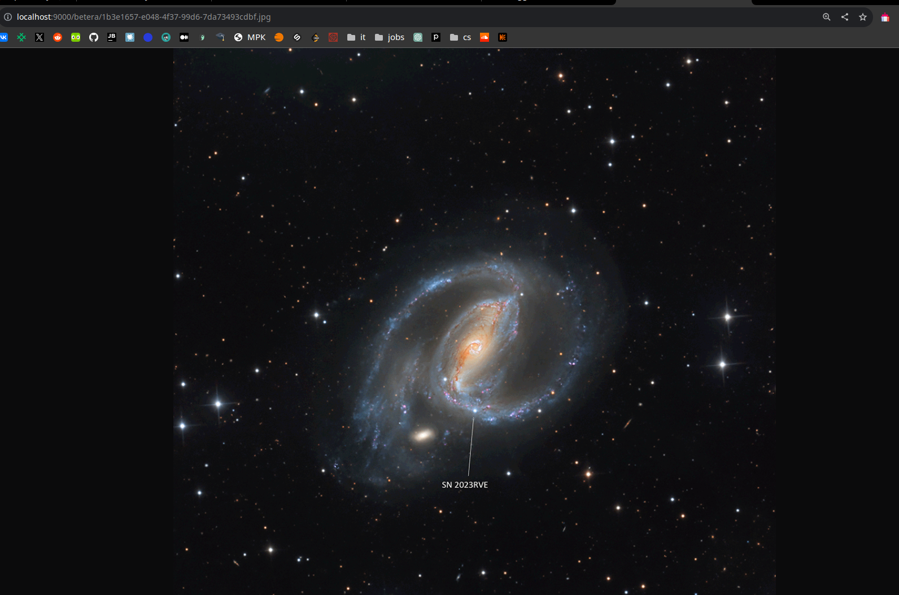

## Основная цель

Сервис должен выполнять основные функции:
1) При помощи воркера раз в сутки получать метаданные и картинку дня [APOD](https://api.nasa.gov/), сохранять в реализованное любым способом бинарное хранилище;
2) Реализовывать Http API сервер: метод получения всех записей альбома и записи за выбранный день;
3) Сервис должен собираться в docker-образ;

## Технологии
1) PostgreSQL в качестве БД
2) Minio в качестве объектного хранилища
3) Docker для деплоя

## Запуск сервиса
```
    docker compose build
    docker compose up
```

## Локальный запуск
```
    make build
```

## Документация 
```
    http://localhost:8080/swagger/index.html
```
чтобы сгенерировать swagger документацию 
```
    make gen_docs
```

Для получения изображения используется Minio на localhost:9000/betera/{image}.
После получения всего альбома или определенного поста будет поле "url", которое является ссылкой на изображение с Minio 

